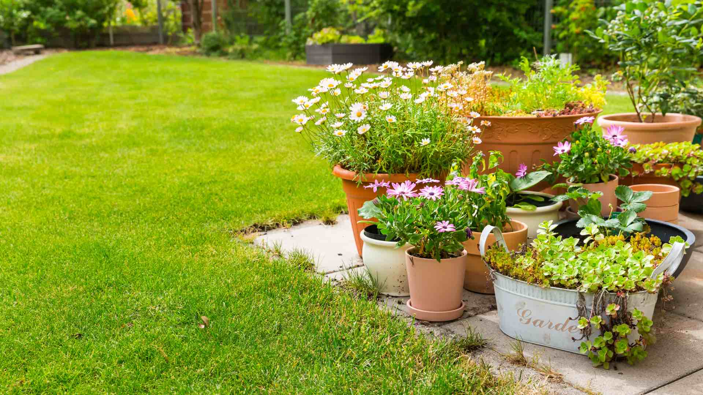
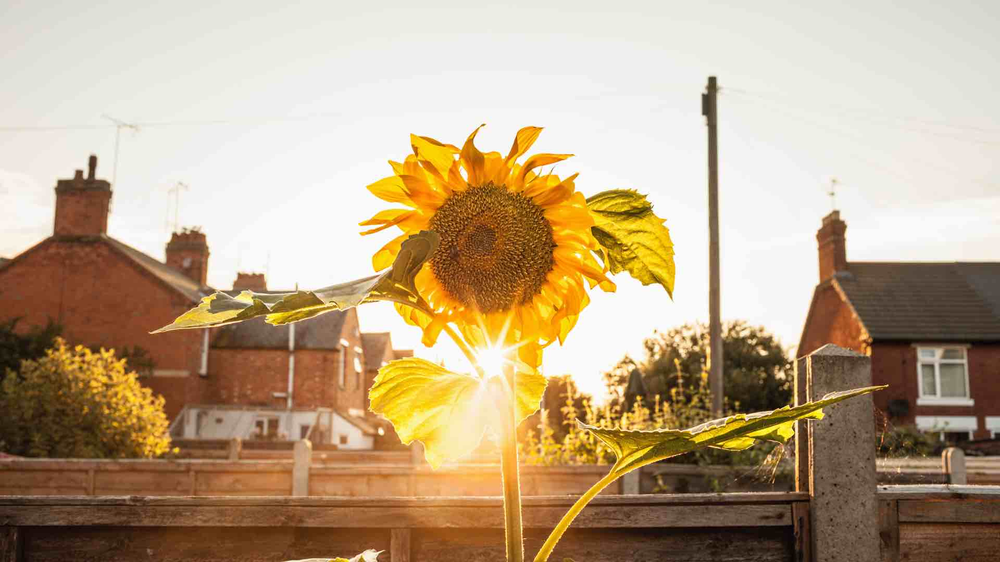
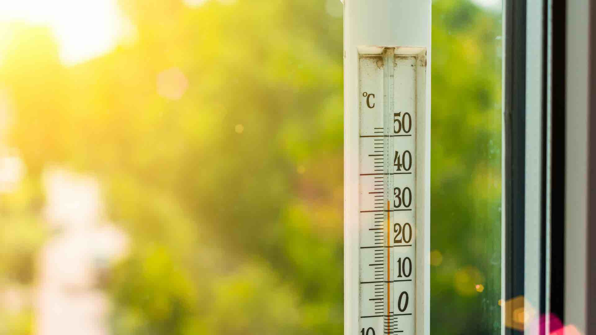

It's that time of year again! Spring is in the air, and that means it's time to plant your garden. But when is the best time to do it? There are a few things you need to take into account before you decide. In this blog post, we will discuss the different factors you need to consider when planting your garden, so you can make sure you're doing it at the right time!

<h2>Determining the Best Time to Plant Your Garden</h2>

<h3>What Will You Grow?</h3>

First, you need to think about what kind of plants you want to grow. Some plants do better in certain seasons than others. For example, if you want to grow tomatoes, you'll need to wait until the weather is warm enough. Otherwise, your tomatoes will not thrive. On the other hand, if you're looking to plant flowers, spring is usually the best time to do it.

<h3>How Much Sunlight Does Your Garden Get Each Day?</h3>

You also need to take into account the number of daylight hours in each season. Plants need sunlight to grow, so if you live in an area with shorter days in winter, it might not be the best time to plant your garden. However, if you live in a location with longer days all year round, then any time is a good time to plant!

<h3>What Is the Temperature in Your Area?</h3>

The temperature is another important factor to consider. If it gets too cold in your area, certain plants will not be able to survive. For example, tropical plants will not do well in a colder climate. Conversely, if it is too hot where you live, other plants might not be able to handle the heat. Make sure you know what kind of temperatures your plants can tolerate before you decide when to plant them!

<h3>Consult Your Local Nursery</h3>

It's always a good idea to consult with your local nursery or gardening center before planting. They will be able to tell you what plants are best for your area and when is the ideal time to plant them. So get some expert advice and then get started on your garden today! Spring is the perfect time to start fresh and watch your beautiful plants grow!

<h2>Get Started Today!</h2>

No matter the time of year, considering the four golden rules below will help set you on the path to success for your next planting season. Good2Grow auto-watering planters are a great way to supercharge your garden area. With optional BlueTooth scheduling and moisture content sensors, you can rest assured your plants are getting the perfect amount of hydration.

